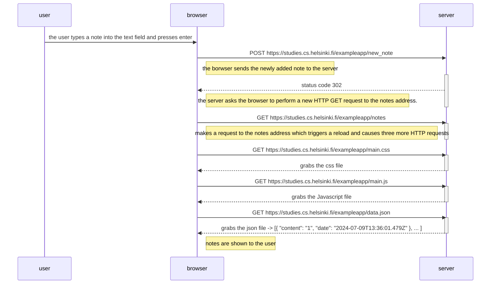

```mermaid
sequenceDiagram
    participant user
    participant browser
    participant server

    user->>browser: the user types a note into the text field and presses enter

    browser->>server: POST https://studies.cs.helsinki.fi/exampleapp/new_note
    Note right of browser: the borwser sends the newly added note to the server
    activate server
    server-->>browser: status code 302
    Note right of browser: the server asks the browser to perform a new HTTP GET request to the notes address.
    deactivate server

    browser->>server: GET https://studies.cs.helsinki.fi/exampleapp/notes
    activate server
    Note right of browser: makes a request to the notes address which triggers a reload and causes three more HTTP requests
    deactivate server

    browser->>server: GET https://studies.cs.helsinki.fi/exampleapp/main.css
    activate server
    server-->>browser: grabs the css file
    deactivate server

    browser->>server: GET https://studies.cs.helsinki.fi/exampleapp/main.js
    activate server
    server-->>browser: grabs the Javascript file
    deactivate server

    browser->>server: GET https://studies.cs.helsinki.fi/exampleapp/data.json
    activate server
    server-->>browser: grabs the json file -> [{ "content": "1", "date": "2024-07-09T13:36:01.479Z" }, ... ]
    deactivate server

    Note right of browser: notes are shown to the user
```