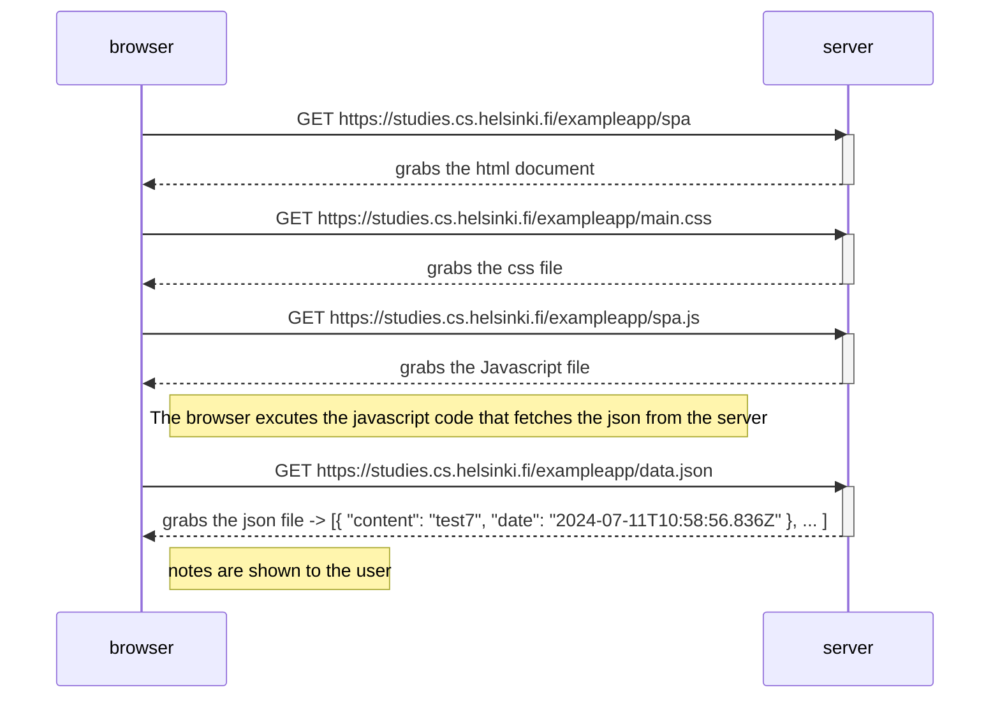

```mermaid
sequenceDiagram
    participant browser
    participant server

    browser->>server: GET https://studies.cs.helsinki.fi/exampleapp/spa
    activate server
    server-->>browser: grabs the html document
    deactivate server

    browser->>server: GET https://studies.cs.helsinki.fi/exampleapp/main.css
    activate server
    server-->>browser: grabs the css file
    deactivate server

    browser->>server: GET https://studies.cs.helsinki.fi/exampleapp/spa.js
    activate server
    server-->>browser: grabs the Javascript file
    deactivate server

    Note right of browser: The browser excutes the javascript code that fetches the json from the server

    browser->>server: GET https://studies.cs.helsinki.fi/exampleapp/data.json
    activate server
    server-->>browser: grabs the json file -> [{ "content": "test7", "date": "2024-07-11T10:58:56.836Z" }, ... ]
    deactivate server

    Note right of browser: notes are shown to the user
```