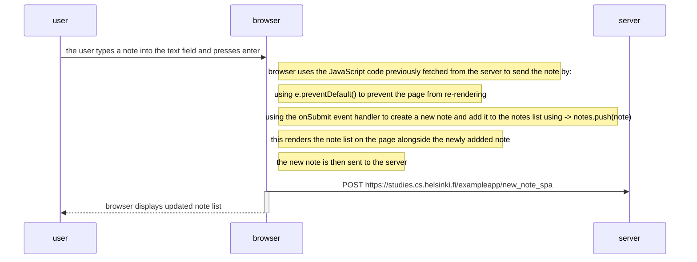

```mermaid
sequenceDiagram
    participant user
    participant browser
    participant server

    user->>browser: the user types a note into the text field and presses enter

    Note right of browser: browser uses the JavaScript code previously fetched from the server to send the note by:
    Note right of browser: using e.preventDefault() to prevent the page from re-rendering
    Note right of browser: using the onSubmit event handler to create a new note and add it to the notes list using -> notes.push(note)
    Note right of browser: this renders the note list on the page alongside the newly addded note
    Note right of browser: the new note is then sent to the server
    browser->>server: POST https://studies.cs.helsinki.fi/exampleapp/new_note_spa

    activate browser
    browser-->>user: browser displays updated note list
    deactivate browser
```